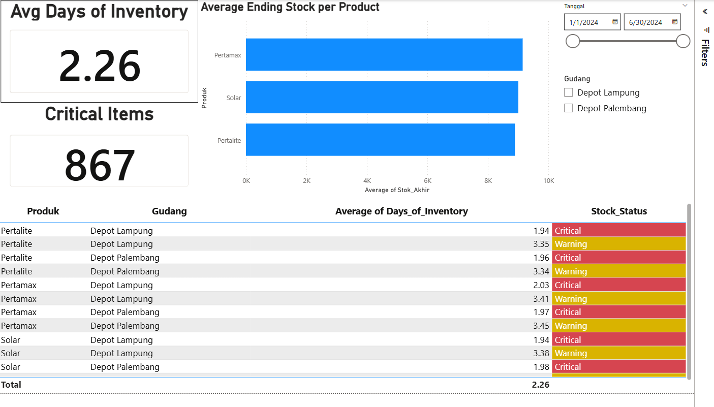
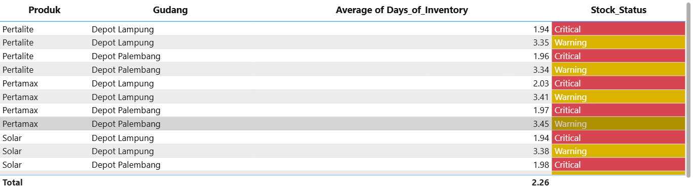

# 🛢️ Energy Distribution & Inventory Monitoring System


## 📌 Project Overview

This project focuses on **Inventory & Distribution Monitoring** for an energy distribution warehouse. The system is designed to mitigate the risk of stockouts caused by daily demand fluctuations and distribution delays from the central hub.

By leveraging **Synthetic Data Generation (Python)** and **Business Intelligence Dashboards (Power BI)**, this tool provides real-time visibility into stock levels, helping stakeholders make data-driven decisions on when to restock.

---

## 💼 Business Requirements

### Business Context
Energy distribution warehouses face significant risks of running out of stock (stockouts) due to:
1.  **Unpredictable Demand:** Daily fluctuations in energy consumption.
2.  **Supply Chain Delays:** Latency in distribution from the central supply center.

### Business Objectives
* ✅ **Maintain Availability:** Ensure daily stock levels are sufficient to meet demand.
* ✅ **Risk Mitigation:** Drastically reduce the probability of stockout events.
* ✅ **Data-Driven Planning:** Assist the supply chain team in planning restocks based on actual consumption trends and lead times.

---

## 📊 Key Performance Indicators (KPIs)

To measure the health of the inventory, the following KPIs were established:

| KPI | Description |
| :--- | :--- |
| **Ending Stock** | The total quantity of fuel/energy available at the end of the operational day. |
| **Days of Inventory (DOI)** | Estimate of how many days the current stock will last based on average daily consumption. |
| **Lead Time** | The time taken from placing a restocking order to receiving the shipment. |
| **Stock Status** | A logic-based classification: **Safe**, **Warning**, or **Critical**. |

---

## 🛠️ Tools & Technologies

* **Python (Pandas & NumPy):** Used for **Synthetic Data Generation**. Since real operational data is confidential, I simulated a dataset that mimics real-world patterns (demand seasonality, lead time variability, and stock movements).
* **Microsoft Excel:** Used for initial data cleaning, validation, and prototyping business logic.
* **Power BI:** Used to build the interactive dashboard for monitoring.

---

## ❓ Key Questions Answered

The dashboard is designed to answer these critical operational questions:
1.  **"What is the Ending Stock for today?"**
2.  **"Which specific products (e.g., Pertalite, Solar) are at risk of stockout?"**
3.  **"When should we trigger a restocking order?"**

---

## 📷 Dashboard Screenshots

### 1. Main Overview

*Provides a high-level view of current stock across all distribution points.*

### 2. Stock Status Detail

*Detailed breakdown of "Critical" vs "Safe" items based on Days of Inventory.*

---

## ⚙️ How to Run This Project

1.  **Clone the repository:**
    ```bash
    git clone [https://github.com/KMoex-HZ/Pertamina_Inventory_Analysis.git](https://github.com/KMoex-HZ/Pertamina_Inventory_Analysis.git)
    ```
2.  **Generate Data (Optional):**
    Run the Python script to generate new synthetic data.
    ```bash
    python data_generator.py
    ```
3.  **Open the Dashboard:**
    Open the `.pbix` file using **Microsoft Power BI Desktop**.
4.  **Refresh Data:**
    Connect the Power BI file to the generated Excel/CSV source and hit "Refresh".

---

## 👤 Author

**Khairunnisa Maharani**
*Data Science Student @ Institut Teknologi Sumatera (ITERA)*
*Pertamina Foundation Scholar (Sobat Bumi Batch 12)*

[LinkedIn](https://www.linkedin.com/in/khairunnisamaharani) | [Email](mailto:email.lo@student.itera.ac.id)
